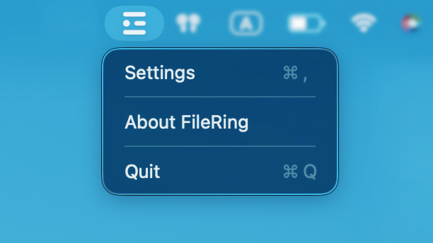

<div align="center">


<br/>

# FileRing

轻扫即可快速访问您的文件和文件夹


[English](README.md) | 简体中文

</div>

## 概述

FileRing 提供一个圆形启动器，显示您最近和最常使用的文件和文件夹。按住可自定义的快捷键即可在光标处打开圆形面板，移动鼠标选择项目，松开快捷键即可打开。界面根据使用模式将项目组织成六个不同的部分。

**基本工作流程：**
1. 按住触发快捷键（默认：`⌃ Control + X`）
2. 出现一个圆形面板，显示六个部分的文件和文件夹
3. 将鼠标移到所需的部分和项目上
4. 松开快捷键执行操作（打开文件/文件夹、复制文件或复制路径）
5. 将光标移到空白区域取消操作


## 功能特性

### 1. 文件分类

FileRing 使用 macOS Spotlight 将您的文件和文件夹分为六个部分：

- **文件 - 最近打开** 🕐
- **文件 - 最近保存** 💾
- **文件 - 常用（3天内）** ⭐
- **文件夹 - 最近打开** 🕐
- **文件夹 - 最近保存** 💾
- **文件夹 - 常用（3天内）** ⭐

每个部分根据您的实际使用情况显示 4-10 个项目（可配置，默认：6），无需手动添加书签。

<div><video src="https://github.com/user-attachments/assets/3e1b0f8e-92a8-483e-a4a1-0ba2f3b20bcc" controls></video></div>

### 2. 快捷操作

将鼠标悬停在任何项目上以显示快速操作：

### 打开
在默认应用程序中启动文件或在访达中打开文件夹

<div><video src="https://github.com/user-attachments/assets/054b5c50-542b-401d-8793-0bae187ab55e" controls></video></div>


<div><video src="https://github.com/user-attachments/assets/c7a1d5e8-56d5-4cb1-9ae0-1c0feb6209ef" controls></video></div>


### 复制文件
将整个文件复制到剪贴板以便粘贴到其他位置（仅限文件）

<div><video src="https://github.com/user-attachments/assets/56ea54bd-bc22-45a0-a41f-9b537adabfed" controls></video></div>

### 复制路径
将绝对文件/文件夹路径复制为文本

<div><video src="https://github.com/user-attachments/assets/84b4d13c-e214-4dca-b814-6c9b1461ac24" controls></video></div>

### 3. 文件夹授权

FileRing 仅访问您明确授权的文件夹。该应用程序对您选择的目录具有只读访问权限，并使用 macOS 安全范围书签来安全访问文件。

### 4. 菜单栏应用

FileRing 是一个轻量级的菜单栏应用程序。（在设置里可以把 Dock 图标设为隐藏）
<div align="center">

</div>

## 安装

### 系统要求

- macOS 13.0 或更高版本
- Apple Silicon 或 Intel 处理器

### 方式一：下载预编译版本（不推荐）

**⚠️ 重要提示：**

由于缺少 Apple 开发者账户，预编译的应用程序**未经过公证或签名**。macOS 会显示安全警告。**强烈建议从源代码构建（方式二）。**

**如果您仍想使用预编译版本：**

1. 从 [Releases](https://github.com/Cosmostima/FileRing/releases) 页面下载最新版本
2. 解压并将 `FileRing.app` 移动到应用程序文件夹
3. 移除隔离属性：
```bash
   xattr -cr /Applications/FileRing.app
```
4. **或者**：右键点击 → "打开" → 在对话框中点击"打开"
5. **如果仍然被阻止**：系统设置 → 隐私与安全性 → "仍要打开"
6. 根据提示授予必要的权限

### 方式二：从源代码构建（推荐）

从源代码构建可让您使用自己的 Apple ID 签名应用程序，避免系统安全警告。


#### GUI 方式（Xcode）

```bash
# 克隆仓库
git clone https://github.com/Cosmostima/FileRing.git
cd FileRing

# 在 Xcode 中打开
open FileRing.xcodeproj
```

**在 Xcode 中：**
1. 在导航器中选择 FileRing 项目
2. 在 TARGETS 下选择 FileRing 目标
3. 转到"Signing & Capabilities"标签
4. 启用"Automatically manage signing"
5. 在 Team 下拉菜单中选择您的 Apple ID（如需要请添加账户）
6. 点击运行（⌘R）以构建和启动

**导出独立应用程序：**
1. Product → Archive
2. 点击"Distribute App"
3. 选择"Copy App"（可能在自定义选项中）
4. 保存到所需位置

#### 命令行方式

```bash
# 克隆仓库
git clone https://github.com/Cosmostima/FileRing.git
cd FileRing

# 构建应用程序
xcodebuild -project FileRing.xcodeproj -scheme FileRing -configuration Release -derivedDataPath build clean build

# FileRing.app 将位于 build/Build/Products/Release/ 目录中
# 然后您可以将其复制到 /Applications 文件夹
cp -r build/Build/Products/Release/FileRing.app /Applications/
open /Applications/FileRing.app
```

**注意：** 命令行构建需要至少在 Xcode 中配置一次代码签名。在使用 `xcodebuild` 之前，请在 Xcode 中打开项目并在"Signing & Capabilities"下设置您的 Apple ID。

## 使用方法

### 初次引导

通常，当您第一次打开此软件时，会有一个引导页面帮助您进行初始化。

您可以：
1. **授权文件夹** 
   - 选择常用的文件夹或添加自定义目录
   - 在系统提示时授予访问权限
2. **测试触发器** - 按住 `⌃ Control + X` 打开面板

### 自定义快捷键

**快捷键要求**

必须组合一个或多个修饰键与一个普通键：
- **修饰键**：⌘ Command、⌃ Control、⌥ Option、⇧ Shift（可以组合多个）
- **普通键**：A-Z、0-9、空格或其他标准键
- **示例**：`⌃X`、`⌥空格`、`⌘⇧D`

**注意**：由于 macOS Carbon API 的限制，不支持仅修饰键的快捷键（如单独按 ⌥ Option）。

**更改快捷键：**
1. 从菜单栏打开设置
2. 点击"快捷键设置"下的快捷键字段
3. 按下您想要的组合键（修饰键 + 普通键）
4. 快捷键立即更新

### 管理文件夹访问

**Setting → Folder Permissions**

**授权文件夹：**
1. 可快速授权常用文件夹
2. 点击"Add"可选择自定义
3. 在系统对话框中授予访问权限

**撤销访问：**
1. 在已授权列表中找到该文件夹
2. 点击文件夹名称旁边的"X"键
3. 该文件夹以及其中的的文件将不再出现在 FileRing 中

**注意**：FileRing 仅查询已授权文件夹内的文件。

### 偏好设置

**设置 → 显示**

- **每个部分的项目数**：从 4 到 10 个项目调整（默认：6）
- **隐藏程序坞图标**：启用以使 FileRing 仅显示在菜单栏（需要重启）

**设置 → 过滤设置**

- **排除的文件夹**：管理要从搜索结果中排除的文件夹（例如 `node_modules`、`__pycache__`）
- **排除的扩展名**：管理要排除的文件扩展名（例如 `.tmp`、`.log`、`.cache`）

点击"管理"可添加或删除项目。更改立即生效。

**设置 → 重置**

- **重置**：删除所有文件夹授权并重新显示引导屏幕

## 灵感来源

FileRing 的交互模型受到 [Loop](https://github.com/MrKai77/Loop) 的启发，这是一个优雅的 macOS 窗口管理工具。

## 许可证

MIT License - 详见 [LICENSE](LICENSE)

---

**使用 Swift 和 SwiftUI 为 macOS 打造**
